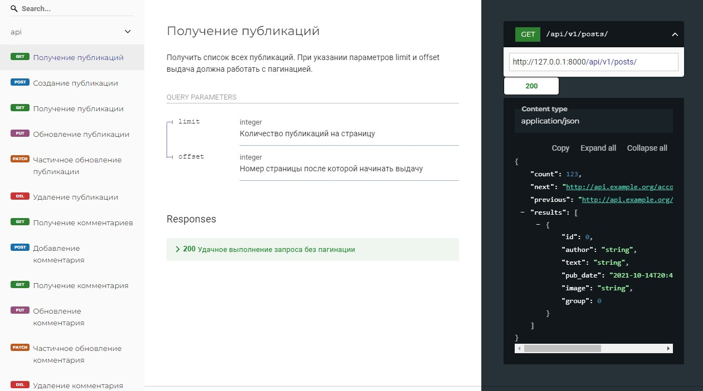

<h1 align="center">api_yatube</h1>


<h2 align="center">Описание</h2>
api_yatube - api блога, в котором доступно написание статей, группировка статей по темам, а также комментирование постов как своих так и чужих, подписка на других авторов. Редактирование и удаление постов доступно только автору поста. Редактировать и удалять комментарии может только автор этого комментария.

<br>

<h2 align="center">Возможности</h2>
На сайте реализованы: <br>
- Создание, редактирование, удаление постов<br>
- Просмотр постов других пользователей<br>
- Комментирование постов<br>
- Подписка на других авторов постов

<h2 align="center">Установка</h2>

### **Необходимая версия Python 3.9.13**
1. Клонируйте проект
2. Создайте виртуальное окружение: 
``` 
python -m venv venv
```
для Linux
```
python3 -m venv venv
```
Если пользуетесь Windows и первый вариант не сработал попробуйте 
```
py -m venv venv
```
3. Активируйте виртуальное окружение 
Если у Вас Windows
```
. venv/Scripts/activate
```
Если у Вас Linux
```
. venv/bin/activate
```
4. Установите все необходимые библиотеки командой 
```
pip install -r requirements.txt
```

<h2 align="center">Взаимодействие с API</h2>
Для начала работы с Api проекта-необходимо зарегистрировать пользователя и получить токен авторизации, отправив POST-запрос, содержащий логин и пароль аккаунта на url:

```
api/v1/jwt/create/
```
<br>
<h2 align="center">Доступные эндпоинты</h2>
<br>
<p align="center">

</p>
<br>
Полная документация проекта доступна после развертывания проекта по ссылке:

```
redoc/
```

Получение списка постов

```
api/v1/posts/
```

Получение, редактирование и удаление поста по id (GET, PUT, PATCH, DELETE)
```
api/v1/posts/{post_id}/
```

Получение списка всех групп (GET) 
```
api/v1/groups/
```
Получение группы по id (GET)
```
api/v1/groups/{group_id}/
```

Получение списка комментариев и отправка комментария к посту с id=post_id (GET, POST) 
```
api/v1/posts/{post_id}/comments/
```

Получение, редактирование и удаление комментария с id=comment_id (GET, PUT, PATCH, DELETE)
```
api/v1/posts/{post_id}/comments/{comment_id}/
```

Получение подписки и подписка на автора (GET, POST)
```
api/v1/follow/
```

<h2 align="center">Технологии</h2>
<p>Проект реализован на языке Python версии 3.9.13</p>
<p>Фреймворк разработки - Django версии 3.2.16</p>
<p>Api реализовано на Django Rest Framework версии 3.12.4</p>